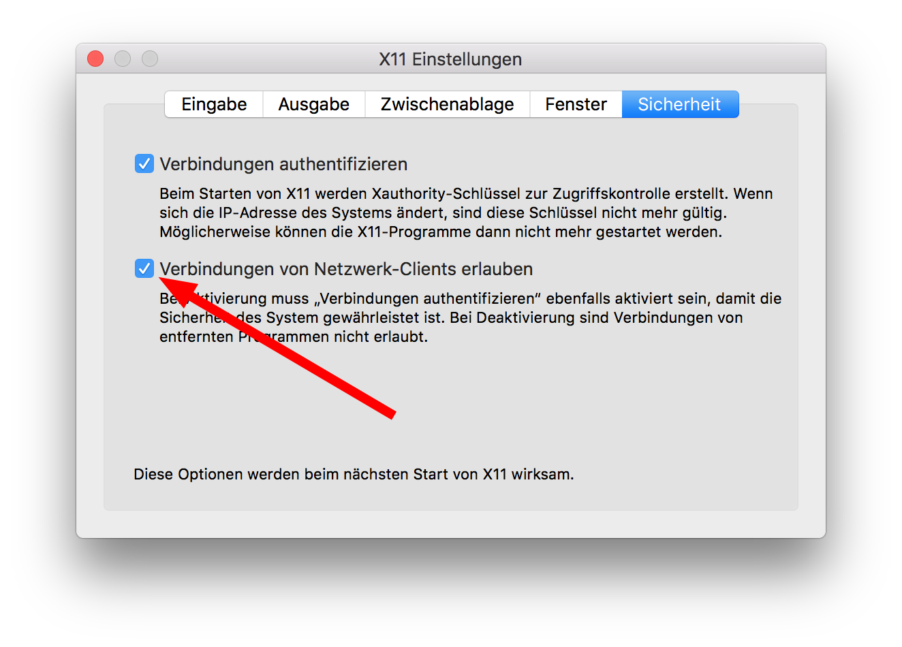

# docker_citrix_receiver_mac

The Citrix Receiver for macos installs a lot of stuff all over your mac.
If you have to use the Citrix Receiver but want to keep your system clean, you can use this Docker container.

## Requirements

* [XQuartz](https://www.xquartz.org)

XQuartz has to be configured such that connections from network clients are allowed.



## Usage

1. Preparation
    * Download .deb Package of the Citrix Receiver
    * adjust the file Dockerfile:
        * replace `COPY icaclient_<VERSION>_amd64.deb /tmp/icaclient.deb`
2. create Docker Image
```
./create_image.sh
```
3. run Citrix Receiver
```
./run.sh
```

## License

[MIT](./LICENSE.txt)
